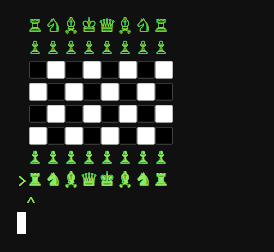
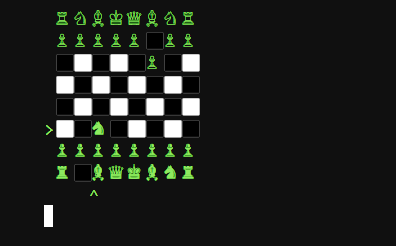
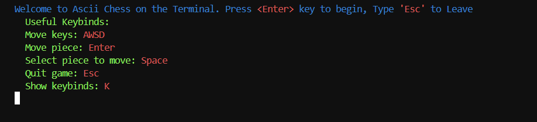

# Ascii Chess on the Terminal

### Features:

> Fully implemented chess, standard piece rule-restrictions (no piece hopping, piece movement enforcement, turn restrictments)

> arrow keys to toggle row and collumns and select a piece (controled by user inputs AWSD), press enter to select a piece, enter a second time to move to the desired location

> Menu pre-game that gives user proper keybind instructions to play the game

> no multiplayer or ai feature, purely singleplayer.

### How to use:
> use AWSD to toggle arrows

> use SPACE to select a piece to move

> use ENTER to move piece to desired location (You must move the arrows to an appropriate position)

> if you fail to choose an appropriate spot for a piece, the piece will be deselected

